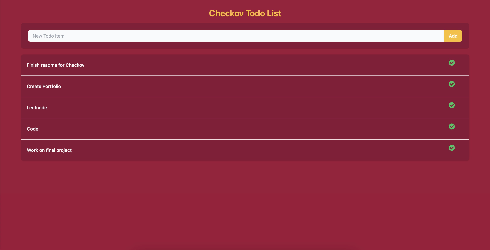

# Checkov To-do
Checkov To-do is a web and mobile application where users can create personal to-do lists.

## Tech
This project was built on a FERN stack
 - Database on [Google Firestore](https://firebase.google.com/docs/firestore)
 - API on [Express](https://expressjs.com/en/api.html)
 - Bootstrapped with [Create React App](https://github.com/facebook/create-react-app)

## Getting Started
In the project directory, you can run:

`npm start`

Runs the app in the development mode.\
Open [http://localhost:3000](http://localhost:3000) to view it in your browser.

The page will reload when you make changes.\
You may also see any lint errors in the console.

## Available Scripts

`npm run build`

Builds the app for production to the `build` folder.\
It correctly bundles React in production mode and optimizes the build for the best performance.

The build is minified and the filenames include the hashes.\
Your app is ready to be deployed!

See the section about [deployment](https://facebook.github.io/create-react-app/docs/deployment) for more information.

